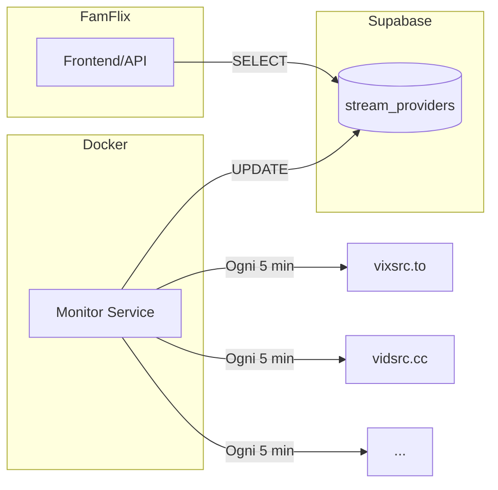

# Provider Monitor System Design

## Overview

Sistema di monitoring per verificare lo stato dei provider di streaming in tempo reale. Composto da:

1. **Monitor Service** - Container Docker con Node.js che esegue health checks periodici
2. **Supabase Table** - Storage centralizzato con tutti i metadati dei provider
3. **FamFlix Integration** - Query al DB per selezionare il miglior provider disponibile



---

## Supabase Table: `stream_providers`

### Schema Completo

| Column | Type | Description |
|--------|------|-------------|
| `id` | `uuid` | Primary key (auto-generated) |
| `key` | `text` | Identificatore univoco del provider (es. `vixsrc`, `vidsrcCc`) |
| `name` | `text` | Nome human-readable (es. "VixSrc", "VidSrc.cc") |
| `host` | `text` | URL base del provider (es. `https://vixsrc.to`) |
| `family` | `text` | Tipo di URL builder: `query-tmdb`, `path-tmdb`, `path-imdb`, `videoid-tmdb` |
| `movie_path_template` | `text` | Template URL per film (es. `/movie/{id}`, `/embed/movie?tmdb={id}`) |
| `tv_path_template` | `text` | Template URL per serie TV (es. `/tv/{id}/{season}/{episode}`) |
| `extra_params` | `jsonb` | Parametri aggiuntivi specifici del provider |
| `is_active` | `boolean` | Provider abilitato manualmente (default: true) |
| `is_healthy` | `boolean` | Ultimo health check passato |
| `status_code` | `integer` | Ultimo HTTP status code ricevuto |
| `response_time_ms` | `integer` | Tempo di risposta in millisecondi |
| `success_rate_24h` | `numeric(5,2)` | Percentuale successo ultime 24h (0.00 - 100.00) |
| `consecutive_failures` | `integer` | Fallimenti consecutivi (reset a 0 dopo successo) |
| `last_check_at` | `timestamptz` | Timestamp ultimo health check |
| `last_success_at` | `timestamptz` | Timestamp ultimo check riuscito |
| `last_failure_reason` | `text` | Motivo ultimo fallimento (timeout, 404, blocked, etc.) |
| `priority` | `integer` | Ordine di priorità manuale (1 = più alto) |
| `supports_movies` | `boolean` | Supporta film |
| `supports_tv` | `boolean` | Supporta serie TV |
| `requires_imdb` | `boolean` | Richiede IMDB ID invece di TMDB |
| `notes` | `text` | Note manuali (es. "molte ads", "UI pulita") |
| `created_at` | `timestamptz` | Data creazione record |
| `updated_at` | `timestamptz` | Data ultimo aggiornamento |

> Vedi `provider_table.sql` per lo schema SQL completo con RLS.

---

## Monitor Service (Node.js)

### Stack Tecnologico

- **Runtime**: Node.js 20 LTS (Alpine per container leggero)
- **Framework**: Express.js (per endpoint di manual trigger da Admin UI)
- **HTTP Client**: `undici` o `node-fetch`
- **Supabase Client**: `@supabase/supabase-js`
- **Scheduler**: `node-cron` per esecuzione periodica
- **Docker**: Immagine multi-stage per build ottimizzata

### Struttura Progetto

```
provider-monitor/
├── src/
│   ├── index.ts              # Entry point + Express server
│   ├── config.ts             # Environment variables
│   ├── db/
│   │   └── supabase.ts       # Supabase client
│   ├── checkers/
│   │   ├── base-checker.ts   # Abstract checker class
│   │   ├── http-checker.ts   # HTTP HEAD/GET check
│   │   └── embed-checker.ts  # Verifica contenuto embed
│   ├── services/
│   │   ├── monitor.ts        # Orchestrazione checks
│   │   └── stats.ts          # Calcolo success_rate
│   └── utils/
│       └── logger.ts         # Logging strutturato
├── Dockerfile
├── docker-compose.yml
├── package.json
└── .env.example
```

### Health Check Logic

```typescript
interface CheckResult {
  isHealthy: boolean;
  statusCode: number | null;
  responseTimeMs: number;
  failureReason: string | null;
}

async function checkProvider(provider: Provider): Promise<CheckResult> {
  const testTmdbId = '550';  // Fight Club - contenuto noto sempre presente
  const testUrl = buildTestUrl(provider, testTmdbId, 'movie');
  
  const start = Date.now();
  
  try {
    const response = await fetch(testUrl, {
      method: 'HEAD',
      headers: {
        'User-Agent': 'Mozilla/5.0 (Windows NT 10.0; Win64; x64) Chrome/120.0.0.0',
      },
      signal: AbortSignal.timeout(10000),
    });
    
    const responseTimeMs = Date.now() - start;
    
    if (!response.ok) {
      return await checkWithGet(testUrl, start);
    }
    
    return {
      isHealthy: true,
      statusCode: response.status,
      responseTimeMs,
      failureReason: null,
    };
    
  } catch (error) {
    return {
      isHealthy: false,
      statusCode: null,
      responseTimeMs: Date.now() - start,
      failureReason: classifyError(error),
    };
  }
}
```

### Express Endpoints (per Admin UI)

```typescript
// POST /api/check-all - Trigger check manuale di tutti i provider
// POST /api/check/:key - Trigger check singolo provider
// GET /api/status - Status del monitor service
```

### Dockerfile

```dockerfile
FROM node:20-alpine AS builder
WORKDIR /app
COPY package*.json ./
RUN npm ci --only=production
COPY . .
RUN npm run build

FROM node:20-alpine AS runner
WORKDIR /app
RUN addgroup -g 1001 -S nodejs && adduser -S monitor -u 1001
COPY --from=builder --chown=monitor:nodejs /app/dist ./dist
COPY --from=builder --chown=monitor:nodejs /app/node_modules ./node_modules
USER monitor
ENV NODE_ENV=production
EXPOSE 3001
CMD ["node", "dist/index.js"]
```

### docker-compose.yml

```yaml
version: '3.8'
services:
  provider-monitor:
    build: .
    container_name: famflix-provider-monitor
    restart: unless-stopped
    ports:
      - "3001:3001"
    environment:
      - SUPABASE_URL=${SUPABASE_URL}
      - SUPABASE_SERVICE_KEY=${SUPABASE_SERVICE_KEY}
      - CHECK_INTERVAL_MINUTES=5
      - LOG_LEVEL=info
      - PORT=3001
    mem_limit: 128m
    cpus: 0.25
```

---

## FamFlix Integration

### Query per Ottenere il Miglior Provider

```typescript
// lib/stream-providers.ts

export async function getBestProvider(
  type: 'movie' | 'tv',
  requiresImdb: boolean = false
): Promise<StreamProvider | null> {
  const { data, error } = await supabase
    .from('stream_providers')
    .select('*')
    .eq('is_active', true)
    .eq('is_healthy', true)
    .eq(type === 'movie' ? 'supports_movies' : 'supports_tv', true)
    .eq('requires_imdb', requiresImdb)
    .order('priority', { ascending: true })
    .order('success_rate_24h', { ascending: false })
    .order('response_time_ms', { ascending: true })
    .limit(1)
    .single();
    
  if (error || !data) return null;
  return data;
}

export async function getAllHealthyProviders(
  type: 'movie' | 'tv'
): Promise<StreamProvider[]> {
  const { data, error } = await supabase
    .from('stream_providers')
    .select('*')
    .eq('is_active', true)
    .eq('is_healthy', true)
    .eq(type === 'movie' ? 'supports_movies' : 'supports_tv', true)
    .order('priority', { ascending: true })
    .order('success_rate_24h', { ascending: false });
    
  return data ?? [];
}
```

### Costruzione URL Dinamica

```typescript
export function buildStreamUrl(
  provider: StreamProvider,
  tmdbId: string,
  type: 'movie' | 'tv',
  season?: number,
  episode?: number
): string {
  const template = type === 'movie' 
    ? provider.movie_path_template 
    : provider.tv_path_template;
    
  if (!template) throw new Error(`No template for ${type}`);
  
  let url = provider.host + template
    .replace('{id}', tmdbId)
    .replace('{season}', String(season ?? 1))
    .replace('{episode}', String(episode ?? 1));
    
  return url;
}
```

---

## Admin UI (app/servers/page.tsx)

La pagina `/servers` diventerà l'Admin UI con le seguenti funzionalità:

- **Lista provider** con stato real-time (healthy/unhealthy)
- **Toggle attivo/disattivo** per ogni provider
- **Modifica priorità** drag & drop
- **Bottone "Check Now"** per trigger manuale (chiama monitor service)
- **Aggiunta/modifica provider** inline
- **Visualizzazione metriche** (success rate, response time, ultimo check)

---

## Vantaggi

| Aspetto | Beneficio |
|---------|-----------|
| **Single Source of Truth** | Tutti i metadati in DB, niente hardcoded |
| **Aggiornamenti Zero-Deploy** | Cambi provider via Admin UI, senza rebuild |
| **Fallback Intelligente** | Ordine basato su dati reali |
| **Disabilitazione Rapida** | Toggle in Admin UI |
| **Scalabile** | Aggiungi nuovi provider con un click |

---

## Prossimi Passi

1. [x] Creare `provider_table.sql` con schema e RLS
2. [ ] Eseguire migration su Supabase
3. [ ] Creare il progetto Node.js per il monitor
4. [ ] Dockerizzare il monitor
5. [ ] Aggiornare Admin UI (`app/servers/page.tsx`)
6. [ ] Aggiornare FamFlix per leggere da DB
7. [ ] Testare flusso end-to-end
